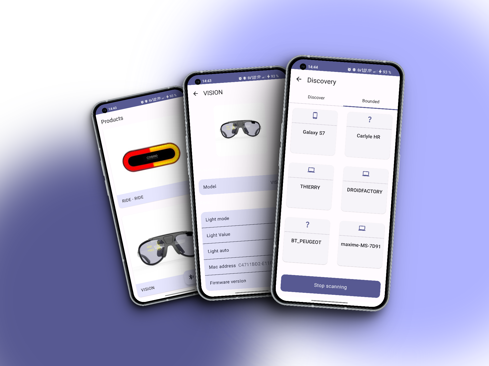

# Cosmo technical assignment

## Mandatory

* [x] : Using Kotlin
* [x] Compatible Android 14
* [x] UI build with Jetpack Compose
* [x] Retrieve data from Cosmo API's
* [x] Error message in case of failure
* [x] Detect Bluetooth devices
* [x] Display their data
* [x] UT

## Bonus

* [x] Offline mode

* [x] Animation

  

# Démo

<video src="screenshots/cosmo.mp4" controls title="Cosmo Demo"></video>

[url](https://youtu.be/UD3RJ2UaFFc)

